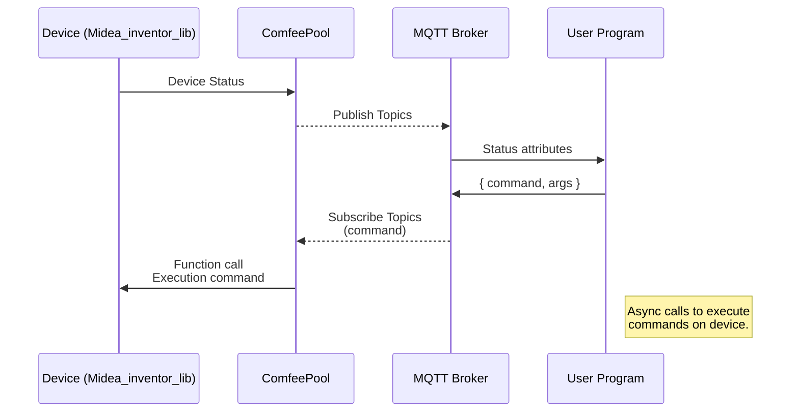

# ComfeePool
A package to integrate Comfee Equipments with MQTT Brokers. This package intends to discover Comfee or Midea Equipment in the network and manage it as a pool of devices that can be accessible through the MQTT Broker.

## Introduction
The package is intended to establish an MQTT interface with the Comfee equipment. The equipment attributes will be readable in the MQTT Broker through a topic in the form _/\<level0>/\<level1>/attribute_. The equipment will be located within a hierarchy of levels in the MQTT Broker, being the device located into 2 levels, typically _location_ and _equipment_, and within the equipment all the attributes of this device.

The special attribute _/\<level0>/\<level1>/\<command>_ is serving as a special attribute to send commands to the device. The commands are those available from the library ___midea_inventor_lib___ and the function behind this package simply wraps a json command with its arguments. This json content is simply passed onto the package ___midea_inventor_lib___ and executes the command onto the equipment. The json document including the execution of a command is in the form:
<pre>
{
	"action": "name of the method",
	"args": "{
				"arg1": "value 1",
				"arg2": "value 2",
				"argN": "value N"
			}
}
</pre>

The name of the the method is one of the ___midea_inventor_lib___ methods. 

## Workflow diagram
The device and the MQTT have the following communication diagram

## Configuration file
The package gives the possibility to configure parameters through a configuration file. This file can be, as an example, like this:
>[comfee]
>logfile=comfeepool.log
>username=<YOUR_USERNAME>
>password=<YOUR_PASSWORD>
>
>[broker]
>ip=127.0.0.1
>port=1883

The configuration file will be splitted into two areas:
- [comfee]: this area defines the midea account, user and password to operate with the device. It also gives the chance to log data to a logfile.
- [broker]: this is the broker ip:port to connect to. This broker is to be setup apart from this package.

## How to install
To install the library just execute:
> pip install ComfeePool

## Example
> \# Configuration of the Shelly device
    config = ComfeePool.ComfeeConfig(sys.argv[1])
    params_Comfee = config.read(section="comfee")
    params_broker = config.read(section="broker")
>
>    print(f"Comfee Devices Pool Version {ComfeePool.\_\_version\_\_}")
    print(f"Creating Pool of Comfee Devices . . . ", end="")
    pool = ComfeePool.ComfeePool(username=params_Comfee['username'], password=params_Comfee['password'], brokerIP=params_broker['ip'], brokerPort=int(params_broker['port']))
    print(f"[ OK ]")
>
 >   print(f"Connecting the pool")
    pool.connect()
    print(f"Discovering devices")
    pool.discover()
>
>    print(f"Running the pool")
    pool.start()
 >   
  >  print(f"Finalizing Comfee Pool . . . [ OK ]")

## Release Notes
**0.1.1** - Initial release

## Credits
 - Midea-inventor-lib - https://pypi.org/project/midea-inventor-lib/
