# Kubiya SDK

Kubiya SDK is a powerful Python library for creating, managing, and executing workflows and tools. It provides a flexible and intuitive interface for defining complex workflows, integrating various tools, and managing their execution.

## Table of Contents

- [Installation](#installation)
- [Quick Start](#quick-start)
- [Key Concepts](#key-concepts)
- [Creating Workflows](#creating-workflows)
- [Defining Tools](#defining-tools)
- [Executing Workflows](#executing-workflows)
- [Visualization](#visualization)
- [API Reference](#api-reference)
- [Examples](#examples)
- [Contributing](#contributing)
- [License](#license)

## Installation

To install the Kubiya SDK, use pip:

```bash
pip install kubiya-sdk
```

## Quick Start

Here's a simple example to get you started with Kubiya SDK:

```python
from kubiya_sdk.workflows import StatefulWorkflow
from kubiya_sdk.tools import register_tool

# Define a simple tool
@register_tool(name="Multiplier", description="Multiplies a number by 2")
def multiply_by_two(number: int) -> int:
    return number * 2

# Create a workflow
workflow = StatefulWorkflow("SimpleWorkflow")

@workflow.step("step1")
def step1(state):
    return {"result": state["input"] * 2}

@workflow.step("step2")
def step2(state):
    return {"final_result": state["result"] + 1}

workflow.add_edge("step1", "step2")

# Run the workflow
result = await workflow.run({"input": 5})
print(result)
```

## Key Concepts

- **Workflows**: Sequences of steps that process and transform data.
- **Steps**: Individual units of work within a workflow.
- **Tools**: Reusable functions that can be integrated into workflows.
- **State**: The data passed between steps in a workflow.

## Creating Workflows

Workflows in Kubiya SDK are created using the `StatefulWorkflow` class:

```python
from kubiya_sdk.workflows import StatefulWorkflow

workflow = StatefulWorkflow("MyWorkflow")

@workflow.step("step_name")
def step_function(state):
    # Process state and return new state
    return {"new_key": "new_value"}

# Connect steps
workflow.add_edge("step1", "step2")
```

### Conditional Workflows

You can add conditions to your workflows:

```python
workflow.add_condition("step1", "state['result'] > 10", "step3")
```

## Defining Tools

Tools are defined using the `@register_tool` decorator:

```python
from kubiya_sdk.tools import register_tool

@register_tool(name="MyTool", description="Description of my tool")
def my_tool(arg1: int, arg2: str) -> dict:
    # Tool logic here
    return {"result": arg1 + len(arg2)}
```

## Executing Workflows

Workflows can be executed asynchronously:

```python
result = await workflow.run({"input": "initial_value"})
```

## Visualization

Kubiya SDK provides Mermaid diagram generation for workflows:

```python
mermaid_diagram = workflow.to_mermaid()
print(mermaid_diagram)
```

This will generate a Mermaid diagram string that can be rendered as follows:

```mermaid
graph TD
    step1["🚀 Step 1"] -->|"Result > 10"| step3["🔧 Step 3"]
    step1 -->|"Result <= 10"| step2["🔧 Step 2"]
    step2 --> END["🏁 End"]
    step3 --> END
    classDef startStyle fill:#A2C4C9,stroke:#005F73,stroke-width:2px,color:#000000;
    classDef endStyle fill:#FFB6B9,stroke:#D7263D,stroke-width:2px,color:#000000;
    classDef stepStyle fill:#EDEDED,stroke:#495057,stroke-width:2px,color:#000000;
    class step1 startStyle;
    class END endStyle;
```



## API Reference

For detailed API documentation, please refer to our [API Reference](https://docs.kubiya.ai/api-reference).

## Examples

### Complex Workflow Example

Here's an example of a more complex workflow that demonstrates various features of the Kubiya SDK:

```python
from kubiya_sdk.workflows import StatefulWorkflow
from kubiya_sdk.tools import register_tool

@register_tool(name="DataFetcher", description="Fetches data from an API")
async def fetch_data(api_url: str) -> dict:
    # Simulated API call
    return {"data": f"Data from {api_url}"}

@register_tool(name="DataProcessor", description="Processes fetched data")
def process_data(data: str) -> dict:
    return {"processed_data": f"Processed: {data}"}

workflow = StatefulWorkflow("ComplexWorkflow")

@workflow.step("fetch_step")
async def fetch_step(state):
    tool = workflow.get_tool("DataFetcher")
    result = await tool.execute(api_url=state["api_url"])
    return {"fetched_data": result["data"]}

@workflow.step("process_step")
def process_step(state):
    tool = workflow.get_tool("DataProcessor")
    result = tool.execute(data=state["fetched_data"])
    return {"processed_data": result["processed_data"]}

@workflow.step("decision_step")
def decision_step(state):
    data_length = len(state["processed_data"])
    return {"data_length": data_length}

@workflow.step("short_data_step")
def short_data_step(state):
    return {"result": f"Short data: {state['processed_data']}"}

@workflow.step("long_data_step")
def long_data_step(state):
    return {"result": f"Long data: {state['processed_data'][:50]}..."}

workflow.add_edge("fetch_step", "process_step")
workflow.add_edge("process_step", "decision_step")
workflow.add_condition("decision_step", "state['data_length'] < 50", "short_data_step")
workflow.add_condition("decision_step", "state['data_length'] >= 50", "long_data_step")

# Execution
result = await workflow.run({"api_url": "https://api.example.com/data"})
print(result)
```

This example demonstrates:
- Tool registration and usage
- Multiple workflow steps
- Conditional branching based on state
- Asynchronous operations

## Contributing

We welcome contributions to the Kubiya SDK! Please see our [Contributing Guidelines](CONTRIBUTING.md) for more information on how to get started.

## License

Kubiya SDK is released under the [MIT License](LICENSE).
