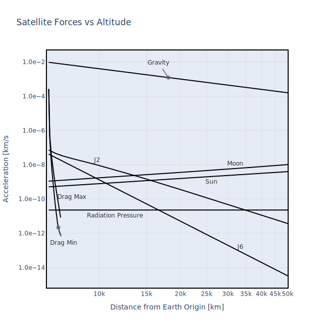

(satprop-doc)=
# High-Precision Orbit Propagation

The ``satkit`` package includes a high-precision orbit propagator, which predicts future (and past) positions and velocities of satellites by integrating the known forces acting upon the satellite. 

The propagator and force models follow very closely the excellent and detailed description provided in the book [**"Satellite Orbits: Models, Methods, Applications"**](https://doi.org/10.1007/978-3-642-58351-3) by O. Montenbruck and E. Gill.  A brief description is provided below; for more detail please consult this reference.

The propagator, like the rest of the package, is written natively in [rust](https://www.rust-lang.org).  This includes both the force model and the Runga-Kutta ODE integrator.  This allows the propagator to run exteremely fast, even when being called from python.

## Mathematical description

The orbit propagator integrates the forces acting upon the satellite to produce a change in velocity, then integrates the velocity to produce a change in position.  Mathematically, this is:

$$
\vec{v}(t_1)~=~\vec{v}(t_0) + \int_{t_0}^{t_1}~\vec{a}\left ( t,~\vec{p}_{t},~\vec{v}_{t} \right ) ~dt

\vec{p}(t_1)~=~\vec{p}(t_0) + \int_{t_0}^{t_1}~\vec{v}(t)~dt
$$

where $\vec{p}(t)$ and $\vec{v}(t)$ are the position and velocity vectors, respectively, of the satellite, and  $\vec{a}\left (t,~\vec{p}(t),~\vec{v}(t) \right )$ is the acceleration vector, which is simply the forces acting upon the satellite (a function of time and satellite position & velocity) divided by the satellite mass.

## Modelled Forces

For a ballistic satellite orbiting the Earth, the forces acting upon the satellite are accurately known.  These are:

* **Earth Gravity**  
The Earth's gravity is the larest force acting on the satellite.  For simpler Keplerian orbit models, the Earth is approximated as a point mass, which is valid if the Earth were spherical with a constant density.  However, the Earth actually has a much more complex shape.  The force of gravity is computed by taking an expansion of Legendre polynomials with coefficients determined by shape and density of the Earth.  For example, the Earth bulges at the center, creating extra mass that pulls inclined orbits toward the equator and causes *precession*.  This is commonly known as the **J2** term in the Legendre expansion.
Multiple experiments have attempted to measure the Legendre coefficients for Earth gravity.  The University of Potsdam maintains a catalog of gravity models [here](https://icgem.gfz-potsdam.de/home).  The ``satkit`` package is able to compute gravity using several of the models published at this site.
  
* **Solar gravity**  
The sun acts as a point mass pulling the satellite toward it.  The sun also pulls the earth towards it, so the force from the sun produces an acceleration in the geocentric frame that must be subtracted from the acceleration due to the 
Earth:  

$$
    \vec{a}~=~GM_{sun}~\left [ \frac{\vec{p} - \vec{p}_{sun}}{|\vec{p} - \vec{p}_{sun}|^3}  - \frac{\vec{p}_{sun}}{|\vec{p}_{sun}|^3} \right ]
$$

> where $G$ is the gravitational constant, $M_{sun}$ is the mass of the sun, and $\vec{p}_{sun}$ is the position of the sun.

* **Lunar gravity**  
The moon, like the sun, acts as a point mass pulling the satellite towards it, and the expression for the acceleration of the satellite due to the moon is very simlar to above:

$$
    \vec{a}~=~GM_{moon}~\left [ \frac{\vec{p} - \vec{p}_{moon}}{|\vec{p} - \vec{p}_{moon}|^3}  - \frac{\vec{p}_{moon}}{|\vec{p}_{moon}|^3} \right ]
$$

> where $G$ is the gravitational constant, $M_{moon}$ is the mass of the sun, and $\vec{p}_{moon}$ is the position of the moon.

* **Drag**  
At about 600km altitude and below, there is enough atmosphere to impose a drag force on the satellite.  The force takes a standard form:

$$
\vec{a}~=~-\frac{1}{2}~C_d~\frac{A}{m}~\rho~\vec{v}_r~|\vec{v}_r|
$$

> where $C_d$ is the unitless coefficient of drag (generally a number between 1.5 and 3), $A$ is the satellite cross-sectional area, $m$ is the mass, $\rho$ is the air density, and $\vec{v}_r$ is the satellite velocity relative to the surrounding air (which is generally assumed to be zero in the *Earth-fixed* frame).  The propagator uses the [NRL-MSISE00](https://ccmc.gsfc.nasa.gov/models/NRLMSIS~00/) density model, and includes space weather effects.

* **Solar Radiation Pressure**  
Momentum transfer to the satellite from solar photons that are scattered or absorbed adds an additional force:

$$
\vec{a}~=~-P_{sun}~\cos(\theta)~A\left [ (1-\epsilon) \hat{p}_{sun} + 2 \epsilon \cos(\theta) \hat{n} \right ]
$$

> where $P_{sun}\approx 4.56\cdot10^{-6}~Nm^{-2}$ is the solar radition pressure in the vicinity of the Earth, $A\cos(\theta)$ is the cross-section of the satellite illuminated by the sun ($\theta$ is the incidence angle), $\epsilon$ is the fraction of light scattred by the satellite (1-$\epsilon$ is absorption), and $\hat{n}$ is the half-angle between the incoming and reflected rays. The propagator includes an additional computation that considers if the sun is shadowed by the Earth.

## Un-modeled forces

The high-precision propagator does not include several additional forces that are generally small.  These include:

* Solid tides of the Earth
* Radiation pressure of Earth albedo
* Gravitational force of other planets
* Relativistic effects

## ODE Solver

The high-precision propagator makes use of standard Runga-Kutta-Fehlberg methods for integrating the equations of motion and error estimation.  The default integrator is a 9th-order RKF integrator with an error estimator of order 8.   A proportional-integral controller is used to set the adaptive step size such that the errors stay within user-defined bounds.  The Butcher table for the default integrator is provided by the *delightful* web page of [Jim Verner](https://www.sfu.ca/~jverner/), and is the same table used in the ODE solver of the same order for the *Julia* programming language.

## State Transition Matrix
The state transition matrix, $\Phi$ describes the partial derivative of the propagated position and velocity with respect to the initial position and velocity:

$$

\Phi~=~\frac{\partial (\vec{p},\vec{v})}{\partial (\vec{p}_0,\vec{v}_0)}

$$

This 6x6 matrix can be computed by numerically integrating the partial derivatives of the accelerations described above, and is useful for "propagating" the 6x6 state coveriance, via the equation below.   Details for computing $\Phi$ are found in [Montenbruck & Gill](montenbruck-gill)

$$

\sigma^2_{p,v}~=~\Phi~\sigma^2_{p_0,v_0}~\Phi^T

$$

The ``satkit`` package includes the option to compute the state transition matrix when solving for the new state.

## Forces vs Altitude

The plot below, modeled on a simlar plot in [Montenbruck and Gill](montenbruck-gill), gives a sense of the various contributors to satellite accelration as a function of altitude:
  
